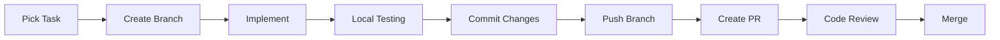

# Professional Companionship App - Development Process

## Table of Contents
1. [Project Overview](#project-overview)
2. [Development Phases](#development-phases)
3. [Sprint Methodology](#sprint-methodology)
4. [Development Workflow](#development-workflow)
5. [Code Standards](#code-standards)
6. [Testing Strategy](#testing-strategy)
7. [Deployment Process](#deployment-process)
8. [Git Workflow](#git-workflow)

## Project Overview

The Professional Companionship App is a sophisticated React Native application that connects users with professional companions. The app features modern UI patterns, secure payment processing, real-time chat, and comprehensive booking management.

### Tech Stack
- **Framework**: React Native 0.80.1
- **State Management**: Redux Toolkit
- **Navigation**: React Navigation v7
- **Forms**: Formik + Yup
- **UI**: React Native Paper, Custom Components
- **Payments**: PayPal & Stripe (WebView)
- **API**: RESTful with Axios

## Development Phases

### Phase 1: Foundation & Authentication (Week 1-2)
**Goal**: Establish robust form infrastructure and authentication flow

#### Sprint 1.1: Form Components (3 days)
- [ ] Enhanced CustomTextInput with TypeScript
- [ ] CustomDropdown with search functionality
- [ ] MultiDropDown with performance optimization
- [ ] TextArea component with Formik
- [ ] RichTextEditor with validation

#### Sprint 1.2: Authentication (4 days)
- [ ] Register flow with validation
- [ ] Login with biometric support
- [ ] Forgot password with OTP
- [ ] Token management system
- [ ] Session handling

#### Sprint 1.3: API Integration (3 days)
- [ ] Axios interceptors setup
- [ ] Error handling middleware
- [ ] Request retry logic
- [ ] Response caching
- [ ] Token refresh mechanism

### Phase 2: Payment Integration (Week 3-4)
**Goal**: Implement secure payment processing

#### Sprint 2.1: Payment Setup (3 days)
- [ ] PayPal WebView enhancement
- [ ] Stripe WebView integration
- [ ] Payment status tracking
- [ ] Transaction history

#### Sprint 2.2: Subscription Management (4 days)
- [ ] Plan selection UI
- [ ] Subscription purchase flow
- [ ] Auto-renewal handling
- [ ] Payment method management

#### Sprint 2.3: Refund System (3 days)
- [ ] Refund request form
- [ ] Status tracking
- [ ] Admin approval flow
- [ ] Refund processing

### Phase 3: Discovery & Booking (Week 5-6)
**Goal**: Main app functionality with discovery and booking

#### Sprint 3.1: Listing & Search (4 days)
- [ ] Profile card optimization
- [ ] Infinite scroll implementation
- [ ] Advanced filtering system
- [ ] Search functionality
- [ ] Favorites management

#### Sprint 3.2: Profile & Booking (4 days)
- [ ] Detailed profile view
- [ ] Availability calendar
- [ ] Booking flow
- [ ] Confirmation system
- [ ] Booking modifications

#### Sprint 3.3: Performance (2 days)
- [ ] List virtualization
- [ ] Image optimization
- [ ] Lazy loading
- [ ] Memory management

### Phase 4: Chat System (Week 7-8)
**Goal**: Complete messaging functionality

#### Sprint 4.1: Chat Infrastructure (4 days)
- [ ] Message polling system
- [ ] Chat list management
- [ ] Message history
- [ ] Typing indicators
- [ ] Read receipts

#### Sprint 4.2: Media Handling (3 days)
- [ ] Image upload with compression
- [ ] Video sharing
- [ ] File attachments
- [ ] Media preview

#### Sprint 4.3: Chat Features (3 days)
- [ ] Chat requests
- [ ] Message search
- [ ] Archive functionality
- [ ] Block/report users

### Phase 5: Dashboard & Analytics (Week 9)
**Goal**: User dashboard and analytics

#### Sprint 5.1: My Bookings (3 days)
- [ ] Booking dashboard
- [ ] Calendar view
- [ ] Booking history
- [ ] Reviews and ratings

#### Sprint 5.2: Analytics (2 days)
- [ ] Earnings tracking
- [ ] Performance metrics
- [ ] Export functionality

### Phase 6: Settings & Polish (Week 10)
**Goal**: Final polish and settings

#### Sprint 6.1: Settings (3 days)
- [ ] Profile settings
- [ ] Notification preferences
- [ ] Privacy settings
- [ ] Help center

#### Sprint 6.2: Polish (2 days)
- [ ] Performance optimization
- [ ] Bug fixes
- [ ] UI refinements
- [ ] Accessibility

## Sprint Methodology

### Sprint Structure
```
Monday: Sprint Planning
- Review previous sprint
- Define sprint goals
- Task assignment
- Estimate effort

Tuesday-Thursday: Development
- Daily standups (10 min)
- Focus time (2-4 hour blocks)
- Code reviews
- Testing

Friday: Sprint Review
- Demo completed work
- Gather feedback
- Document learnings
- Plan next sprint
```

### Task Management

#### Task States
1. **Backlog**: Not started
2. **In Progress**: Currently working
3. **Review**: Code review needed
4. **Testing**: QA in progress
5. **Done**: Completed and tested

#### Task Sizing
- **XS**: < 2 hours
- **S**: 2-4 hours
- **M**: 4-8 hours
- **L**: 1-2 days
- **XL**: 3-5 days (should be broken down)

## Development Workflow

### Daily Development Cycle



### Feature Development Process

1. **Planning**
   ```
   - Review requirements
   - Create technical design
   - Break into subtasks
   - Estimate effort
   ```

2. **Implementation**
   ```
   - Write clean code
   - Follow style guide
   - Add comments for complex logic
   - Create unit tests
   ```

3. **Testing**
   ```
   - Run unit tests
   - Manual testing
   - Cross-platform testing
   - Edge case validation
   ```

4. **Documentation**
   ```
   - Update README
   - Add inline documentation
   - Update API docs
   - Create user guides
   ```

## Code Standards

### TypeScript Guidelines
```typescript
// Use interfaces for object shapes
interface User {
  id: string;
  name: string;
  email: string;
}

// Use enums for constants
enum Status {
  PENDING = 'pending',
  ACTIVE = 'active',
  INACTIVE = 'inactive'
}

// Use type for unions
type ButtonVariant = 'primary' | 'secondary' | 'danger';
```

### Component Structure
```typescript
// Standard component structure
import React, { FC, useState, useEffect } from 'react';
import { View, Text, StyleSheet } from 'react-native';

interface ComponentProps {
  title: string;
  onPress: () => void;
}

const Component: FC<ComponentProps> = ({ title, onPress }) => {
  // Hooks
  const [state, setState] = useState(false);

  // Effects
  useEffect(() => {
    // Effect logic
  }, []);

  // Handlers
  const handlePress = () => {
    onPress();
  };

  // Render
  return (
    <View style={styles.container}>
      <Text>{title}</Text>
    </View>
  );
};

const styles = StyleSheet.create({
  container: {
    flex: 1,
  },
});

export default Component;
```

### Naming Conventions
- **Files**: PascalCase for components, camelCase for utilities
- **Components**: PascalCase
- **Functions**: camelCase
- **Constants**: UPPER_SNAKE_CASE
- **Interfaces**: PascalCase with 'I' prefix optional
- **Types**: PascalCase

### Code Quality Rules
1. No console.logs in production
2. Handle all promise rejections
3. Add loading states for async operations
4. Implement proper error boundaries
5. Use memoization for expensive computations
6. Avoid inline styles
7. Keep components under 200 lines
8. Extract reusable logic to custom hooks

## Testing Strategy

### Testing Levels

#### 1. Unit Testing
```javascript
// Test individual functions and components
describe('LoginScreen', () => {
  it('should validate email format', () => {
    expect(validateEmail('test@example.com')).toBe(true);
  });

  it('should show error for invalid email', () => {
    expect(validateEmail('invalid')).toBe(false);
  });
});
```

#### 2. Integration Testing
```javascript
// Test component interactions
describe('Authentication Flow', () => {
  it('should navigate to dashboard after successful login', async () => {
    // Test implementation
  });
});
```

#### 3. E2E Testing
```javascript
// Test complete user flows
describe('User Journey', () => {
  it('should complete booking flow', async () => {
    // Test implementation
  });
});
```

### Testing Checklist
- [ ] All functions have unit tests
- [ ] Critical paths have integration tests
- [ ] Forms validate correctly
- [ ] Error states display properly
- [ ] Loading states work
- [ ] Navigation flows correctly
- [ ] API calls handle errors
- [ ] Platform-specific code tested

## Deployment Process

### Pre-Deployment Checklist
1. **Code Quality**
   - [ ] All tests passing
   - [ ] No console errors
   - [ ] Lint checks pass
   - [ ] TypeScript compilation successful

2. **Performance**
   - [ ] Bundle size optimized
   - [ ] Images compressed
   - [ ] Lazy loading implemented
   - [ ] Memory leaks checked

3. **Security**
   - [ ] API keys secured
   - [ ] Sensitive data encrypted
   - [ ] Authentication tested
   - [ ] Permissions validated

### Build Process

#### iOS Build
```bash
# Clean and build
cd ios && pod install
npm run ios:clean
npm run ios:build

# Archive for App Store
npm run ios:archive
```

#### Android Build
```bash
# Clean and build
cd android && ./gradlew clean
npm run android:build

# Generate APK
npm run android:apk

# Generate Bundle
npm run android:bundle
```

### Release Steps
1. **Version Bump**
   ```bash
   npm version patch/minor/major
   ```

2. **Changelog Update**
   ```markdown
   ## Version X.Y.Z
   - Feature: Description
   - Fix: Description
   - Enhancement: Description
   ```

3. **Testing**
   - Internal testing
   - Beta testing
   - UAT approval

4. **Deployment**
   - Deploy to staging
   - Smoke testing
   - Deploy to production
   - Monitor metrics

## Git Workflow

### Branch Strategy
```
main
├── develop
│   ├── feature/user-authentication
│   ├── feature/payment-integration
│   └── feature/chat-system
├── release/v1.0.0
└── hotfix/critical-bug
```

### Branch Naming
- **Feature**: `feature/description`
- **Bug Fix**: `fix/description`
- **Hotfix**: `hotfix/description`
- **Release**: `release/vX.Y.Z`

### Commit Convention
```
<type>(<scope>): <subject>

<body>

<footer>
```

**Types**:
- `feat`: New feature
- `fix`: Bug fix
- `docs`: Documentation
- `style`: Code style
- `refactor`: Code refactoring
- `test`: Testing
- `chore`: Maintenance

**Examples**:
```bash
feat(auth): add biometric login support
fix(chat): resolve message ordering issue
docs(api): update endpoint documentation
```

### Pull Request Template
```markdown
## Description
Brief description of changes

## Type of Change
- [ ] Bug fix
- [ ] New feature
- [ ] Breaking change
- [ ] Documentation update

## Testing
- [ ] Unit tests pass
- [ ] Integration tests pass
- [ ] Manual testing completed

## Screenshots
If applicable

## Checklist
- [ ] Code follows style guidelines
- [ ] Self-review completed
- [ ] Comments added for complex code
- [ ] Documentation updated
- [ ] No new warnings
```

## Monitoring & Maintenance

### Performance Metrics
- App launch time < 2 seconds
- Screen transition < 300ms
- API response time < 1 second
- Crash rate < 1%
- Memory usage < 200MB

### Error Tracking
- Implement Sentry/Bugsnag
- Log critical errors
- Monitor crash reports
- Track API failures
- User feedback system

### Regular Maintenance
- **Weekly**: Dependency updates
- **Monthly**: Performance audit
- **Quarterly**: Security audit
- **Yearly**: Major version planning

## Resources

### Documentation
- [React Native Docs](https://reactnative.dev/docs/getting-started)
- [Redux Toolkit](https://redux-toolkit.js.org/)
- [React Navigation](https://reactnavigation.org/)
- [Formik](https://formik.org/)

### Tools
- **IDE**: VS Code with React Native Tools
- **Debugging**: Flipper
- **Testing**: Jest, Detox
- **CI/CD**: GitHub Actions
- **Monitoring**: Sentry

### Team Contacts
- **Tech Lead**: [Contact]
- **Product Owner**: [Contact]
- **QA Lead**: [Contact]
- **DevOps**: [Contact]

---

Last Updated: 2025-09-28
Version: 1.0.0